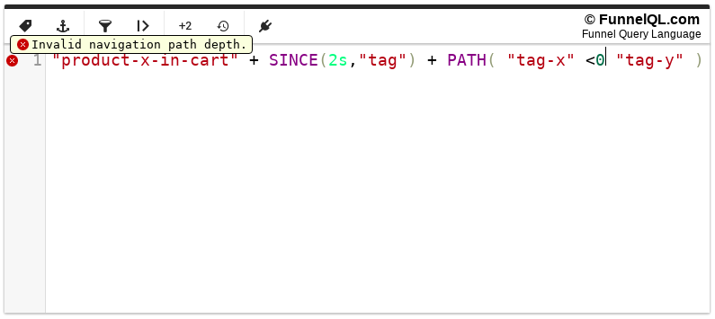

# WYSIWYG Editor

[CodeMirror](https://github.com/codemirror/CodeMirror) based WYSIWYG editor with lint \(error reporting\) for Funnel Query Language.

<<<<<<< HEAD

=======

>>>>>>> 8a4fe9bd45a65673e3048d0747fa51ad68a8e3a8

## Installation

```bash
npm install funnelql-editor
```

## Including the editor

The FunnelQL editor library can be included like any regular javascript file, is safe to include in concatenation and can be loaded asynchronously.

The editor consists of a `mode` and `lint` extension of [CodeMirror](https://github.com/codemirror/CodeMirror) with a custom WYSIWYG toolbar and application frame.

The editor provides a CodeMirror extension `funnelql-editor.js` and a combination package that includes CodeMirror `funnelql-editor+codemirror.js`.

When using the extension you need to manually load `lib/codemirror.js` and `addon/lint/lint.js` from the CodeMirror package that can be installed using NPM:

```bash
npm install codemirror
```

It is not required to install codemirror when using the combination package.

### FunnelQL editor + codemirror combined

```markup
<link rel="stylesheet" href="css/funnelql-editor+codemirror.css" />
<script src="js/funnelql-editor+codemirror.js" async></script>
```

### FunnelQL editor extension only

If CodeMirror is already present on a page you can include just the FunnelQL editor mode and lint extension.

```markup
<!-- Optional: from CodeMirror package -->
<link rel="stylesheet" href="node_modules/codemirror/lib/codemirror.css" />
<link rel="stylesheet" href="node_modules/codemirror/addon/lint/lint.css" />
<script src="node_modules/lib/codemirror.js"></script>
<script src="node_modules/addon/lint/lint.js"></script>

<!-- Required: FunnelQL editor extension -->
<link rel="stylesheet" href="css/funnelql-editor.css" />
<script src="js/funnelql-editor.js" async></script>
```

## Setup

The editor can be installed on any `<textarea>`. The FunnelQL Javascript library should be loaded before a FunnelQL editor is instantiated.

```markup
<textarea type="text" id="funnelql_editor" style="width:100%;height:250px;"></textarea>
```

The editor can be loaded using the Javascript constructor `FunnelQLEditor` with as first parameter a string ID reference or HTML element of a `<textarea>` and optionally a second parameter with [CodeMirror Options](https://codemirror.net/doc/manual.html#config).

```javascript
var fql_editor = FunnelQLEditor('funnelql_editor', {
    /* Optional: CodeMirror options */
});
```

#### FunnelQL CodeMirror API extension

The `FunnelQLEditor` constructor returns a CodeMirror editor object enhanced with additional API methods.

| Method | Description |
| :--- | :--- |
| `parse` | Parse the FunnelQL input and return the parsed JSON via a Promise. |

For information about the CodeMirror API, see [https://codemirror.net/doc/manual.html\#api](https://codemirror.net/doc/manual.html#api)

