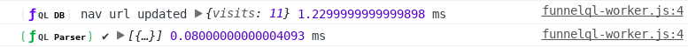

# JavaScript API

Start by installing the FunnelQL Javascript library \(see [Installation](javascript-api.md#install)\).

## Loading the FunnelQL database

Funnel Query Language is based on a IndexedDB database that can persist or expire with the browser session. You can configure the database using the `init` method.

```javascript
$FQL.init({
  expire: 'session'
});
```

### Database Configuration Options

| Option | Description | Default |
| :--- | :--- | :--- |
| `expire` | Database expiration. | `session` \(could be `never` or a time in seconds\) |

The FunnelQL API is chainable and provides a onload callback.

```javascript
$FQL.on('load')
  .then(function() {
    // database loaded
  });
```

## Writing A Funnel

The Funnel data-set is based on tags that can be set with the following method:

```javascript
$FQL.tag('tag-name');
```

During navigation, URLs are automatically registered. The following method can be used to manually register a navigation:

```javascript
$FQL.nav('URL or path/');
```

## Querying A Funnel

The following method can be used to perform a query based on a Funnel Query string or JSON:

```javascript
$FQL.query( "funnel query" ).then(function(result) {
  // result = true/false (boolean)
});
```

The following method can be used to parse a Funnel Query string into JSON:

```javascript
$FQL.parse( "funnel query" ).then(function(json) {
  // json
});
```

The following method can be used to perform an action as soon as a Funnel Query string or JSON matches the path of the visitor:

```javascript
$FQL.on( "funnel query" ).then(function(result) {
  // result = true 
});
```

Alternatively, the `on` method accepts a callback instead of a promise and multiple queries as a Array.

```javascript
$FQL.on( [ "funnel query 1", "funnel query 2" ], function(result, fql) {
  // result = true 
  // fql = funnel query string
});
```

The library can provide detailed debug information including Performance API timings in the browser console. The following method can be used to enable debug mode or to retrieve it's status.

```javascript
$FQL.debug(true);
```



